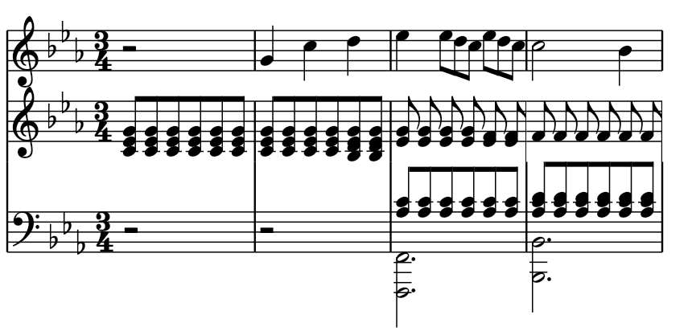
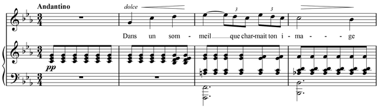

# MusicXML Parser and Notation Renderer for Flutter

This library provides a parser for MusicXML files, and a custom renderer to display the parsed music notation in Flutter apps.

## Before using

Before you can use this library, you need to ensure you have the following software installed on your system:

1. Dart: This library is written in Dart, so you need to have the Dart SDK installed. You can download it from [the Dart website](https://dart.dev/get-dart).

2. Flutter: Since this library includes a Flutter widget for rendering music notation, you need to have Flutter installed as well. You can download it from [the Flutter website](https://flutter.dev/docs/get-started/install).

### Familiarity with MusicXML

This library is designed for parsing and rendering MusicXML files. It assumes that you are familiar with the MusicXML format and how to use it to represent musical scores. If you're not already familiar with MusicXML, you may want to review the [MusicXML documentation](https://www.musicxml.com/for-developers/) before using this library.

### Understanding of Flutter

The renderer included in this library is a Flutter widget. Therefore, a basic understanding of how to use Flutter and how to build UIs with Flutter widgets is necessary. If you're new to Flutter, the [Flutter documentation](https://flutter.dev/docs) provides a wealth of resources to help you get started.

### SMuFL Standard

Our library uses the SMuFL (Standard Music Font Layout) standard for music symbols in the rendered output. For precise rendering, you should have a SMuFL compliant font installed in your system. A list of such fonts can be found [here](https://www.smufl.org/fonts/).

### Current status

||
|:--:|
| *Current rendering of Gabriel Fauré "Après un rêve"* |

||
|:--:|
| *Target rendering of Gabriel Fauré "Après un rêve"* |

**IMPORTANT NOTE:** This library is currently in its early stages of development and not ready for production use. The API is still under active development and can change frequently. We strongly advise not using this library in a production environment as breaking changes may occur.

This library is currently in a **preview phase** and we welcome all developers who are interested in contributing and helping us shape the future of this library.

## Installation

To install the library, add the following to your `pubspec.yaml` file:

```yaml
dependencies:
  your_musicxml_library: ^0.1.0
```

Then run `flutter pub get`.

## Usage

First, import the library:

```dart
import 'package:your_musicxml_library/your_musicxml_library.dart';
```

You can then use the MusicXmlParser class to parse MusicXML data:

```dart
var parser = MusicXmlParser();
ScorePartwise score = parser.parse(xmlString);
```

To display the parsed music notation, you can use the MusicNotation widget:

```dart
MusicNotation(score: score)
```

## Testing

### Golden Tests

This project uses golden tests with the [Alchemist](https://pub.dev/packages/alchemist) package to ensure that components are rendered correctly.

To generate or update the golden files:

```sh
flutter test --update-goldens --tags golden
```

To run only the golden tests:

```sh
flutter test --tags golden
```

To run all tests except for the golden tests:

```sh
flutter test --exclude-tags golden
```

## Future

We understand that everyone believes they are the center of the universe, but let's face it, this package has its limitations. It may not fulfill all your extravagant demands or cater to every whim and fancy. Life is tough, and so is software development.

Here are some features and improvements we are considering (but not guaranteed):

- Support for additional XML validation rules and constraints (e.g. 'token' type validation);
- Enhanced error handling and error reporting;
- Improved documentation and examples;
- Simple classes remake with upcoming [extension types](https://github.com/dart-lang/language/issues/2727);

## Contributing

Contributions and feedback are always welcome. If you encounter any issues or have suggestions for improvements, feel free to open an issue or submit a pull request. However, please understand that the development and maintenance of this package depend on the availability and interests of the contributors.

*Just keep in mind that we're not here to cater to your every desire. We might pretend to care and even consider your suggestions.*

## License

This project is licensed under the MIT License.
